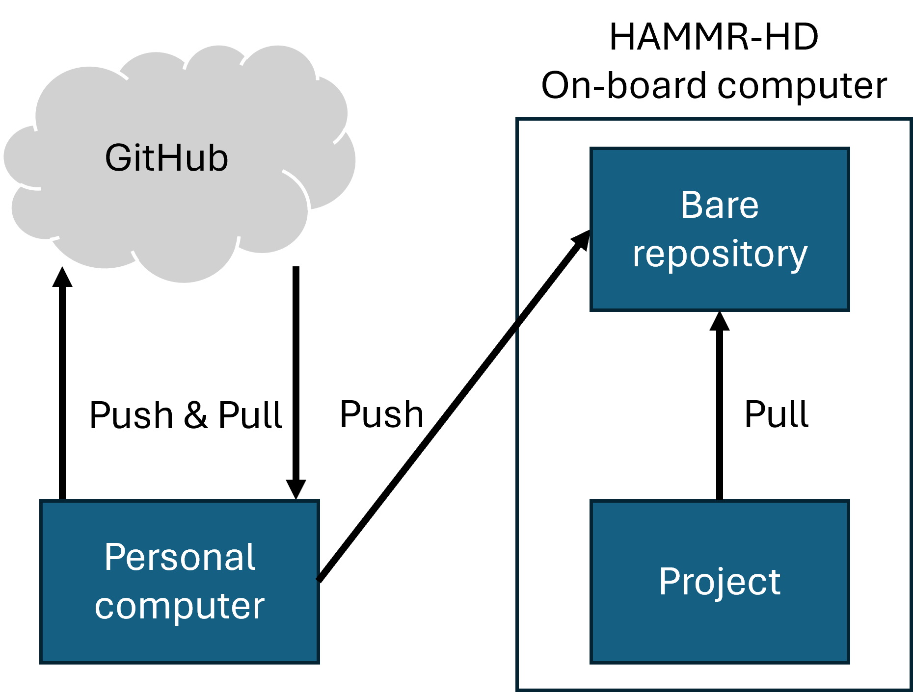

# Software
This software uses `uv` as a project/environment manager, which can be read about [here](https://docs.astral.sh/uv/) and installed using the directions on that page. To build the Python environment defined in `pyproject.toml`, simply run `uv sync`. To ensure that code is run using this environment, use `uv run [python script]`.

It should be assumed that the instrument will not have internet access. To apply code repo changes to the instrument computer, set up a reference repository (called a bare repo) on the instrument which can be pushed to from the controlling computer.

## Initial Setup
### Step 1: Initialize Instrument Computer
This step should already be done.

On the instrument computer in the home directory `~`:
* Create two Git project folders: `git init DataSystemPy3` and `git init --bare DataSystemPy3.git`
* `cd DataSystemPy3` and `git remote add localbare ../DataSystemPy3.git`

The project folder now has DataSystemPy3.git as a reference with the label "localbare". Next, set up the controlling computer so that changes can be pushed to DataSystemPy3.git.

### Step 2: Initialize the Controlling Computer
This step should already be done on the HP Laptop, but you may also want to do it on other computers that might be used.

On the controlling computer in the existing project folder (presumably cloned from GitHub), simply add the remote reference: 
* `git remote add instrument ssh://msl@169.254.51.248/home/msl/DataSystemPy3.git`

To push changes to the instrument computer:
* `git push instrument main`
  * This updates the "main" branch on the instrument computer.

# Hardware

## USB Connections
All of the data streams are serial via USB adapters, with one USB connection per instrument (radiometer, thermistors, GPS-IMU). Ubuntu assigns the USB connections to `dev/ttyUSB#`, where the assigned number seems to be consistent with the physical USB port.
Following [this post](https://stackoverflow.com/questions/24714241/ttyusb-numbers-are-changing-after-reboot), I fixed the connection names as "ttyUSB-xxx" for rad (motor), thm, and gps. This seems to work provided that the USB hardware remains in the same port, and the custom names won't show up if they don't connect to the specified port.

If you need to determine which connection is which, you can use the command `dmesg | grep tty` to get an idea. The Thermistor and Radiometer adapters are FTDI, and the motor and GPS-IMU adapters are cp210x.

The USB labeled "Motor" is disconnected, because all communication with the motor is handled by the FPGA via ethernet.

## FPGA / Buffer Board
The FPGA connection is via ethernet and has a fixed IP of 10.10.10.2. Data is sent via Port 30. Connecting to this IP requires the computer to be configured correctly -- setting the IP to 10.10.10.1 and the Gateway Mask to 255.255.255.0 works for this.

## GPS-IMU
The GPS-IMU unit is an SBG Systems IG-500N unit.

## Thermistors & Analog-Digital Converters
There are 40 platinum resistance thermometers (PRTs) used to monitor HAMMR's hardware, connected in sets of 8 to 5 SuperLogics 8017 ADC units. [Model KS502J2](https://www.digikey.com/en/products/detail/KS502J2/615-1073-ND/2651614), and [Model SP44906X-15](https://www.mouser.com/ProductDetail/Measurement-Specialties/SP44908X-15?qs=aXGKoampmnlT%2FWgkyUFuAQ%3D%3D)

Temperatures are polled in software and returned as voltages. The conversion to Kelvin uses the Steinhart-Hart Equation (see [here](https://assets.omega.com/spec/44000_THERMIS_ELEMENTS.pdf)):
$$
T^{-1} = A + B\log(R) + C\log(R)^3 + D\log(R)^5
,$$
where
$$
R = 5000 * (V / (V_r - V))
$$
and the regulated voltage $V_r$ is either 1.06 or 1.12 (I've seen conflicting info and use 1.12). The coefficents $A - D$ are determined by calibration and depend on the PRT model. We use the following values:
|   | Model 44906 GSFC         | Model KS502J2              |
|---|--------------------------|----------------------------|
| A | 1.29337828808 x 10^-3    | 1.28082086269172 x 10^-3   |
| B | 2.34313147501 x 10^-4    | 2.36865057309759 x 10^-4   |
| C | 1.09840791237 x 10^-7    | 0.902634799967035 x 10^-7  |
| D | -6.51108048031 x 10^-11  | 0                          |

## Radiometer
Following the HAMMR-HD overhaul, only the Advanced Microwave Radiometer (AMR) channels are handled by this software. Code may refer to 'mw' or 'amr'.
