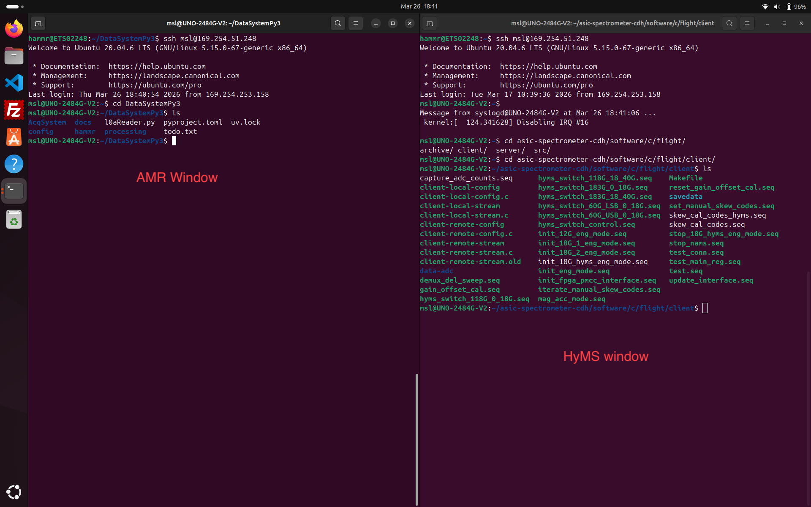
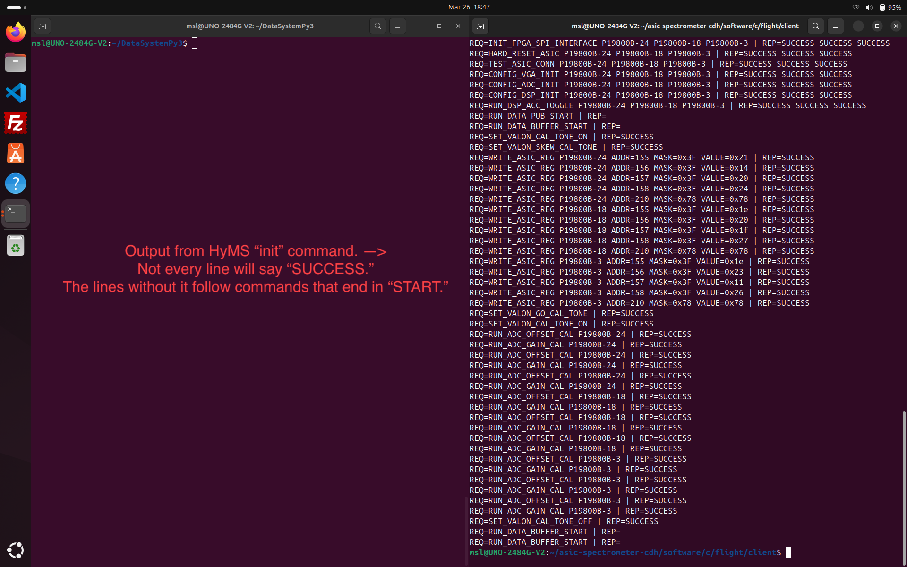
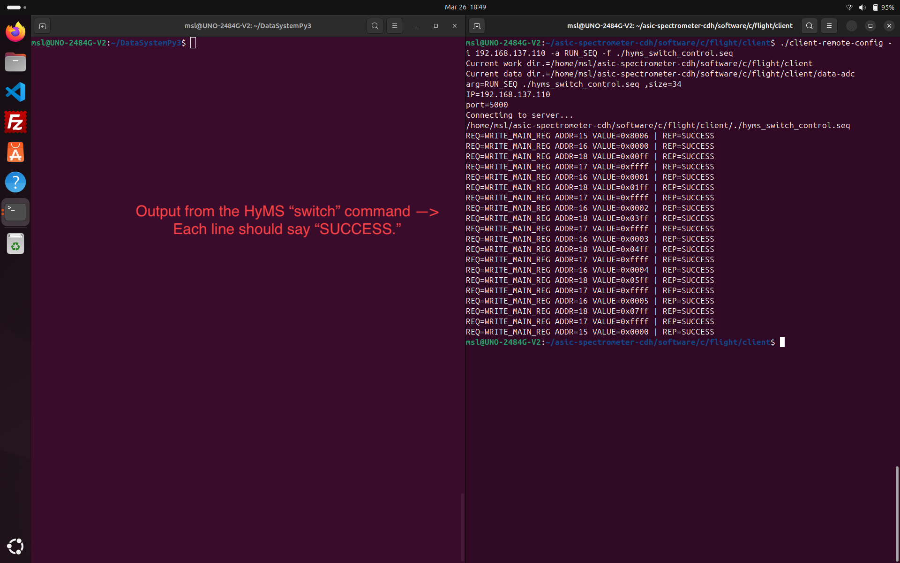
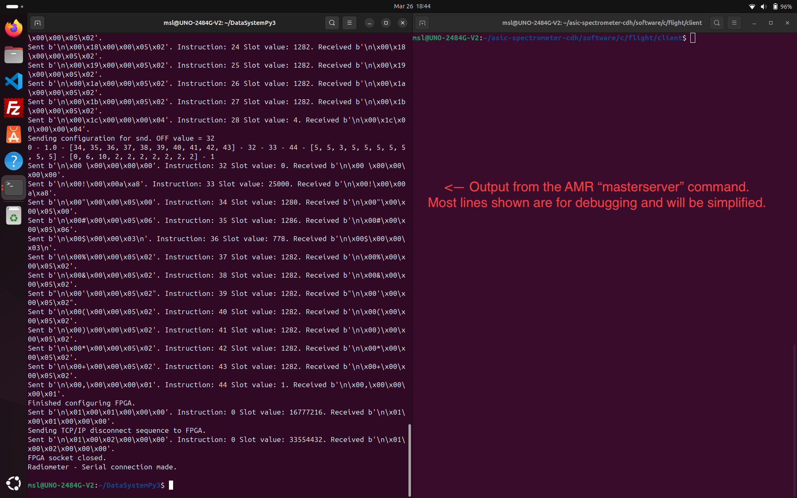
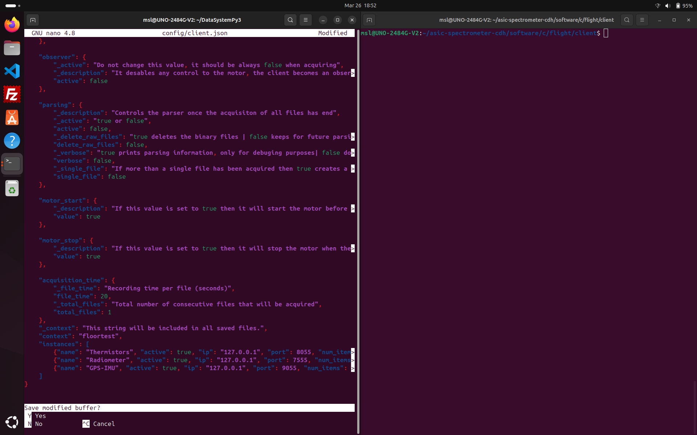
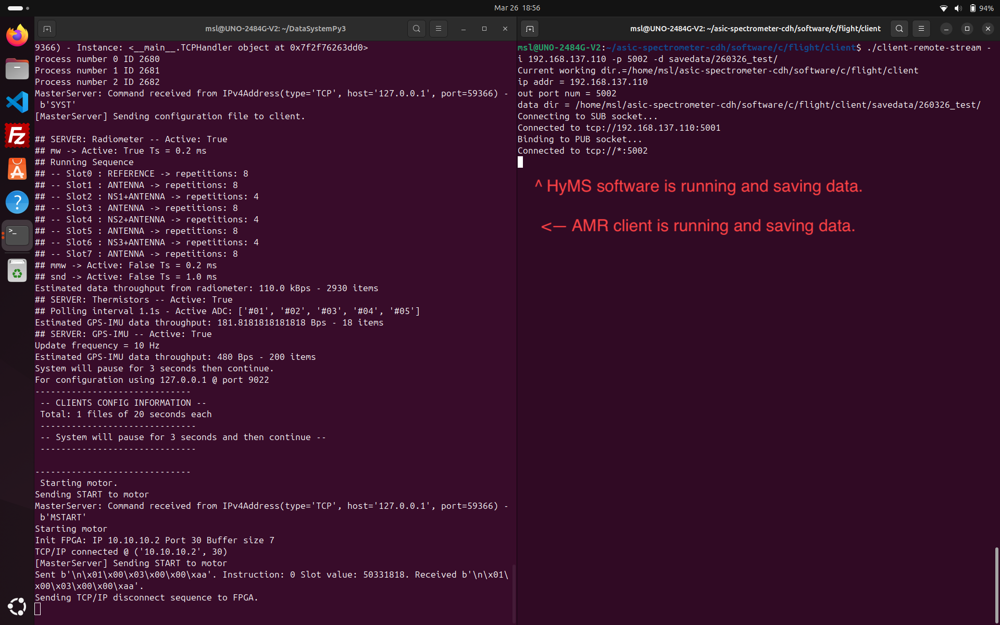
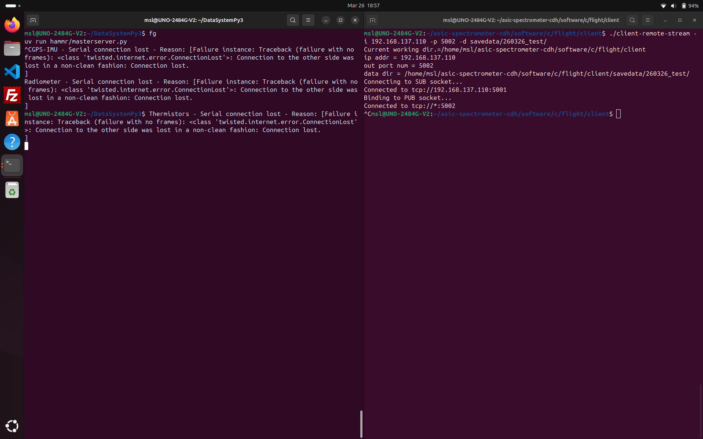

# Steps for Acquisition
## Connect
1. Power on HAMMR-HD. Wait a short time (~30 s) for the on-board computer to fully boot (see Troubleshooting #2). You can test the connection with a `ping` command.
    * `ping 169.254.51.248`
2. Connect to the HHD on-board computer in TWO separate terminals.
    * `ssh msl@169.254.51.248` in each terminal window.
3. Designate one window for AMR and the other for HMS and change to the project directory in each.
    * AMR: `cd DataSystemPy3`
    * HMS: `cd asic-spectrometer-cdh/software/c/flight/client`
    

## Configure HMS
1. In the HMS window, send the confguration to the FPGA. This will take a long time (over a minute).
    * `./client-remote-config -i 192.168.137.110 -a RUN_SEQ -f ./init_18G_hyms_eng_mode.seq`
    * Most lines should say "SUCCESS" but some will be empty.
    * There was an error that running this more than once would lock the FPGA into a non-measuring state. This should be fixed, but try to avoid it.
    
2. Send the switching sequence to the FPGA. This will take some time (~30 s).
    * `./client-remote-config -i 192.168.137.110 -a RUN_SEQ -f ./hyms_switch_control.seq`
    
3. Make a directory within `./savedata/` where data will be saved to.
    * `mkdir ./savedata/[new directory]`

## Configure AMR
1. Run the AMR server application in the background. This configures the FPGA and other hardware and begins streaming data that will be collected when the client application starts.
    * `uv run hammr/masterserver.py &`
    * The `&` at the end sends the command to the background.
    * Press `ENTER` to return to the command prompt.
    

There should be no need to reconfigure the systems past this point. The acquisition softwares below can be stopped and started as many times as desired.

## Start the acquisition softwares
1. In the AMR terminal, change the client configuration.
    * `nano config/client.json`
    * There is a default LN2 config called `ln2.json`.
    * To save and quit nano, press `CTRL + X`, `Y`, and then `ENTER`.
    
2. In the AMR terminal, run the AMR client application.
    * `uv run hammr/masterclient.py`
    * A specific config (such as for LN2) can be passed: `uv run hammr/masterclient.py ln2.json`
3. In the HMS terminal, run the HMS acquisition.
    * `./client-remote-stream -i 192.168.137.110 -p 5002 -d data/[new directory]/` **The `/` at the end of the directory is required.**
    * This will hold the HMS terminal so you can't pass more commands.
    

## To stop the softwares
1. The AMR client will end when the config definition is complete.
    - Using `CTRL + C` will stop acquisition, but not all of the running scripts. See Troubleshooting #1.
2. Kill the HMS acquisition with `CTRL + C`
3. Bring the AMR server to the foreground with `fg` and use `CTRL + C` to kill.

## Transferring Data
Data is saved in the folders `/data/hyms/` and `/data/amr/`. The simplest way to copy this to the operator laptop is the `rsync` tool to copy only the new files. From a local terminal, i.e., _not_ connected to the instrument with SSH:
`rsync -avP msl@169.254.51.248:/data ~/cristaldata`

The default file explorer app has a connection to the instrument via SSH that can be used to transfer files in a GUI.

# Quick Looks
## HyMS

## AMR

# Troubleshooting
1. (AMR) "Port is already in use" or similar
    * Happens if the script doesn't finish cleanly, and subserver scripts are still running. You can confirm this using the command `ps`. Kill those scripts with `killall python` `killall python3` and `killall uv`.
2. (SSH) "No route to host"
    * The hardware connection is fine. This is apparently something to do with how the IP tables are refreshed when the connection is made, and probably happens if you try to SSH before the system is fully booted. Unplug and re-plug the ethernet connections from either or both sides and try again. The HAMMR side works better. Once fixed you should not disconnect again.

## Known Issues
* (HMS) Save directory is restricted to software directory.
    * SOLVED using a symlink.
* (Acquisition) Not confirmed if this can run headless, i.e., running script is possibly coupled to SSH connection.
    * (untested) `nohup` command

# Reference
## Glossary
- AMR - Advanced Microwave Radiometer (18--34 GHz)
- HMS or HyMS - Hyperspectral Microwave Radiometer (120--180 GHz)
- NTP - Network Time Protocol

## Useful Linux Commands
- `ls` list the contents of the current directory.
- `cd [directory]` change directories (folders).
- `cat [file]` prints the contents of a file.
- `nano [filename]` nano is a command-line text editor.
    - Use `CTRL + X` to exit, then `Y` to save and `ENTER` for the same filename.
- `uv run [python script]` uv is a tool to manage Python environments. Using `uv run` within the project directory ensures that the correct environment is used.
- `~` shorthand for the user's home directory, i.e., `/home/msl/`.
- `.` shorthand for the current directory.
- `..` shorthand for the parent of the current directory.
- Pressing `TAB` will try to autocomplete things like paths, and if there are multiple that could be filled then pressing `TAB` again will list them.
- The up arrow key will fetch previously entered commands.

## Paths
* AMR software: `/home/msl/DataSystemPy3`
* HMS software: `/home/msl/asic-spectrometer-cdh/software/c/flight/client`
* HMS data: `/data/hyms`
* AMR data: `/data/amr`